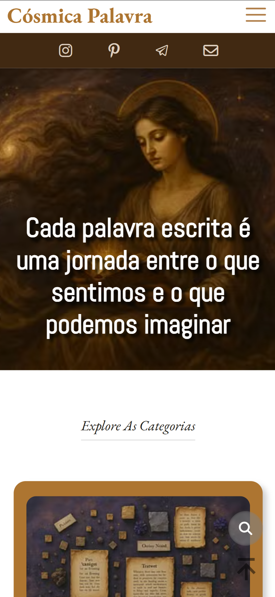

Olá, apresento-lhes o **_Cósmica Palavra_**! Um blog sobre escrita criativa e escrita expressiva criado em parceria com minha excelentíssima amiga escritora **_[Julia Abreu](https://www.linkedin.com/in/julia-abreu-637b47268)_**.

### Tecnologias utilizadas no projeto:

 

### Exibição:

